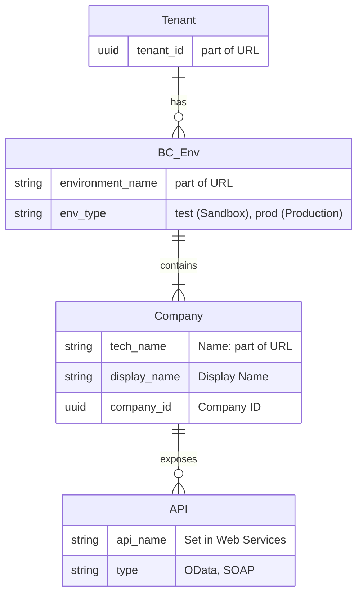

# TXO AI Development Prompt Template v3.1

> **Purpose**: Structured prompt for generating TXO-compliant Python scripts using established patterns  
> **Workflow**: Upload docs → Define requirements → Generate code → Create documentation  
> **Token Efficiency**: Prevents AI hallucination by providing existing functions

## ⚠️ Human TODO before use:
1. Copy this prompt file amd change name
2. **Read** the ADR document `ai/decided/txo-business-adr_v3.1.md` and browse `ai/decided/txo-technical-standards_v3.1.md`
3. Make sure you have a clear understanding of the reality and your requirements 
4. Decide your `org_id` and `env_type`parameters.
5. Fill in your details. Remember that ERD in Mermaid format is awesome!
6. Remove "Remove before AI" parts

---

## Template Validation Checklist (Remove before AI)

Before using this template, verify:

- [ ] All Phase 1 documents are current version (v3.1)
- [ ] Configuration templates match your project needs, OR instruct AI to help you adapt config.
- [ ] JSON schema is up-to-date with latest config structure, OR instruct AI to adapt it after good config..
- [ ] You have specific, actionable requirements for Phase 2
- [ ] Script purpose aligns with TXO patterns (automation, data processing, API integration)

---

## Example Usage of This Template (Remove before AI)

```xml

<usage-example>
    <scenario>Business Central Customer Sync Script</scenario>

    **Phase 1**: Upload the 5 required documents ✓

    **Phase 2**: Fill in requirements

    ```xml

    <script-name>bc-customer-sync</script-name>
    <script-purpose>Sync customer data from CSV file to Business Central, handling duplicates and generating sync report
    </script-purpose>
    <requires-authentication>true</requires-authentication>
    <input-data>CSV file: customer_export.csv with columns: name, email, phone, address</input-data>
    <output-data>Excel report: sync-results.xlsx showing created/updated/failed operations</output-data>


    **Phase 3**: AI generates complete script using existing TXO functions

    **Phase 3.5**: Validate script against TXO compliance checklist ✓
    - Run TXO compliance validator
    - Run PyCharm Code Inspection
    - (Optional) Provide PyCharm feedback to AI for code improvements

    **Phase 4**: AI generates README.md and in-depth-README.md following TXO patterns
</usage-example>
```

---

## Phase 1: Context Upload

**Upload these documents to establish TXO patterns and available functions:**

```xml

<required-documents>
    <required-document>
        <doc-type>business-rules</doc-type>
        <file>ai/decided/txo-business-adr_v3.1.md</file>
        <purpose>Organizational patterns, hard-fail philosophy, naming conventions</purpose>
    </required-document>

    <required-document>
        <doc-type>technical-standards</doc-type>
        <file>ai/decided/txo-technical-standards_v3.1.md</file>
        <purpose>Python patterns, thread safety, memory optimization</purpose>
    </required-document>

    <required-document>
        <doc-type>function-reference</doc-type>
        <file>ai/decided/utils-quick-reference_v3.1.md</file>
        <purpose>🚨 DO NOT INVENT - Shows all existing utils/ functions</purpose>
    </required-document>

    <required-document>
        <doc-type>configuration-example</doc-type>
        <file>config/org-env-config_example.json</file>
        <purpose>Configuration structure and available settings</purpose>
    </required-document>

    <required-document>
        <doc-type>validation-schema</doc-type>
        <file>schemas/org-env-config-schema.json</file>
        <purpose>JSON schema for configuration validation</purpose>
    </required-document>
</required-documents>
```

**Instructions for Phase 1:**

- Read and understand TXO business rules and technical patterns
- Note the available functions in`utils/` - DO NOT create new versions of existing functions
- Understand the configuration structure and mandatory files
- Use the schema to validate any configuration file changes
- Request the user to upload the required-documents if not provided. Help the user by providing PATH from project root.

---

## Phase 2: Requirements Specification

**Fill in your script requirements below:**



```xml

<project-specification>
    <script-name>[YOUR_SCRIPT_NAME]</script-name>
    <script-purpose>
        <!-- Describe what problem this script solves -->
        [EXAMPLE: "Sync customer data between Business Central and local database, handling duplicates and validation
        errors"]
    </script-purpose>

    <org-env-context>
        <organization-id>[YOUR_ORG_ID]</organization-id>
        <environment-type>[YOUR_ENV_TYPE]</environment-type>
        <requires-authentication>[true/false]</requires-authentication>
    </org-env-context>

    <org-env-reality>
        <!-- Describe the reality the script will work with? -->
        [EXAMPLE:
        - An Azure Tenant with UUID [EXAMPLE], that has
        - Multiple Business Central (BC) environments, but we only work with one now: [EXAMPLE], these have
        - One or more organizations (ORG), and we have these: [EXAMPLE]
        - In each ORG we need to call these APIs: [EXAMPLE]
        - Example of API URI: [EXAMPLE]
    </org-env-reality>

    <data-sources>
        <input-data>
            <!-- What data does the script process? -->
            [EXAMPLE:
            - CSV file with customer records (data/customers.csv)
            - API endpoints: /customers, /accounts
            - Database table: customer_mapping]
        </input-data>

        <output-data>
            <!-- What does the script generate? -->
            [EXAMPLE:
            - Excel report with sync results (output/customer-sync-results.xlsx)
            - Updated customer records in Business Central
            - Log file with detailed operation history]
        </output-data>
    </data-sources>

    <business-logic>
        <processing-steps>
            <!-- Step-by-step what the script should do -->
            [EXAMPLE:
            1. Load customer data from CSV file
            2. Validate email addresses and required fields
            3. Check for duplicates in Business Central
            4. Create new customers, update existing ones
            5. Handle validation errors gracefully
            6. Generate summary report with ✅/❌ indicators]
        </processing-steps>

        <error-handling>
            <!-- How should errors be handled? -->
            [EXAMPLE:
            - Skip invalid records but log details
            - Retry API calls on rate limits (429)
            - Continue processing if individual records fail
            - Generate detailed error report for manual review]
        </error-handling>
    </business-logic>

    <api-integrations>
        <!-- If the script calls external APIs -->
        <api-endpoints>
            [EXAMPLE:
            - Business Central: GET/POST /api/v2.0/companies/{companyId}/customers
            - Rate limit: 100 calls/minute
            - Authentication: OAuth client credentials]
        </api-endpoints>

        <resilience-requirements>
            [EXAMPLE:
            - Circuit breaker after 5 consecutive failures
            - Exponential backoff with jitter
            - Automatic retry on 5xx errors]
        </resilience-requirements>
    </api-integrations>

    <configuration-needs>
        <!-- What configuration options does the script need? -->
        [EXAMPLE:
        - API base URL and tenant ID
        - Batch size for processing (default: 50)
        - Email validation regex pattern
        - Retry limits and timeout values]
        - BC Base URL
    </configuration-needs>
</project-specification>
```

**Instructions for Phase 2:**

- Be specific about data formats (CSV columns, JSON structure, etc.)
- Define clear success/failure criteria
- Specify any business rules or validation logic
- Identify configuration that should be adjustable vs. hard-coded

---

## Phase 3: Code Generation Request

Based on the uploaded TXO documentation and the requirements above, generate a complete Python script that:

```xml

<code-requirements>
    <compliance>
        <business-rules>✅ Follow all TXO Business ADRs (hard-fail config, logging context, etc.)</business-rules>
        <technical-standards>✅ Use TXO Technical Standards (thread safety, exception hierarchy, etc.)
        </technical-standards>
        <existing-functions>🚨 CRITICAL: Only use functions from utils-quick-reference_v3.1.md - DO NOT INVENT
        </existing-functions>
    </compliance>

    <implementation-requirements>
        - **Script structure**: Use standard TXO pattern with logger, config, data_handler initialization
        - **Path management**: Use `Dir.*` constants, never string literals
        - **Error handling**: Use TXO custom exceptions with helpful messages
        - **Results tracking**: Implement `ProcessingResults` pattern for user-friendly summaries
        - **Logging context**: Use `[Env/Org/Operation]` format throughout
        - **Configuration**: Hard-fail access with `config['section']['key']` pattern
        - **File operations**: Use `data_handler.save()` and `data_handler.load()` with auto-detection
    </implementation-requirements>

    <code-structure>
        # Expected script structure (fill in the business logic):

        from utils.logger import setup_logger
        from utils.script_runner import parse_args_and_load_config
        from utils.load_n_save import TxoDataHandler
        from utils.path_helpers import Dir

        # [Additional imports based on requirements]

        logger = setup_logger()
        data_handler = TxoDataHandler()

        def main():

        # 1. Initialize with TXO patterns

        config = parse_args_and_load_config("Script description", require_token=[true/false])

        # 2. [Your business logic here]

        # 3. Results tracking and summary
        results = ProcessingResults()
        # [Process data and track results]
        logger.info(results.summary())

        if __name__ == "__main__":
        main()

    </code-structure>
</code-requirements>
```

**Deliverables for Phase 3:**

1. **Complete Python script** following TXO patterns
2. **Configuration file updates** if new settings needed
3. **Usage instructions** with example command line
4. **Error scenarios** and how the script handles them

---

## Phase 3.5: TXO Compliance Validation

**CRITICAL**: Before proceeding to documentation, validate the generated code against TXO patterns.

### **Mandatory Self-Review Checklist**

Review the generated script and answer these questions:

```xml

<tko-compliance-validation>
    <api-patterns>
        <question>Does the script use create_rest_api() instead of manual requests.Session()?</question>
        <check>Look for: import requests, session = requests.Session()</check>
        <fix>Replace with: from utils.api_factory import create_rest_api</fix>
    </api-patterns>

    <timestamp-patterns>
        <question>Does the script use get_utc_timestamp() for timestamps?</question>
        <check>Look for: datetime.now().strftime(), manual UTC formatting</check>
        <fix>Replace with: TxoDataHandler.get_utc_timestamp(), save_with_timestamp()</fix>
    </timestamp-patterns>

    <directory-patterns>
        <question>Does the script use Dir.* constants instead of string literals?</question>
        <check>Look for: 'output', 'config', 'data' as strings</check>
        <fix>Replace with: Dir.OUTPUT, Dir.CONFIG, Dir.DATA</fix>
    </directory-patterns>

    <configuration-patterns>
        <question>Does the script use hard-fail config access?</question>
        <check>Look for: config.get('key', default)</check>
        <fix>Replace with: config['key']  # Hard-fail if missing</fix>
    </configuration-patterns>

    <complexity-patterns>
        <question>Does the script avoid unnecessary complexity?</question>
        <check>Look for: timing code, file size logging, performance metrics</check>
        <fix>Remove unless specifically requested by user</fix>
    </complexity-patterns>

    <framework-patterns>
        <question>Does the script follow the standard TXO script pattern?</question>
        <check>parse_args_and_load_config(), TxoDataHandler(), setup_logger()</check>
        <fix>Use utils-quick-reference_v3.1.md complete script pattern</fix>
    </framework-patterns>
</tko-compliance-validation>

```

### **Validation Process for Non-Experienced Users**

**Step 1: Run TXO Compliance Check**
```bash
# Automated TXO compliance validation (recommended)
PYTHONPATH=. python utils/validate_tko_compliance.py src/your_script.py

# Manual checks (if needed)
grep -n "import requests\|session = requests\|datetime.now" your_script.py
grep -n "'output'\|'config'\|'data'" your_script.py
grep -n "\.get(" your_script.py
```

**Step 2: Run PyCharm Code Inspection (Recommended)**
```
1. In PyCharm: Code → Inspect Code...
2. Select your script file (not whole project to avoid markdown noise)
3. Click "OK" to run analysis
4. Review results in "Inspection Results" panel
5. Focus on Python-specific issues:
   - PyTypeCheckerInspection (type mismatches)
   - PyUnusedImportsInspection (unused imports)
   - PyBroadExceptionInspection (overly broad exceptions)
   - PyShadowingNamesInspection (variable shadowing)
6. Save Python-specific reports to code_inspection/ for AI review
```

**Step 3: Compare with Reference**
- Open `ai/decided/utils-quick-reference_v3.1.md`
- Look at the "Complete Script Pattern" section
- Verify your script follows the same import structure
- Check the "❌ What NOT to Do" section for violations

**Step 4: Auto-Fix Issues**
If violations found, immediately refactor before proceeding to Phase 4.

**Validation Complete When:**
- ✅ No manual HTTP requests (uses create_rest_api)
- ✅ No manual timestamps (uses get_utc_timestamp)
- ✅ No string directory literals (uses Dir.*)
- ✅ No soft-fail config access (uses config['key'])
- ✅ No unnecessary complexity (focused on core functionality)
- ✅ PyCharm inspection shows no critical issues

### **AI Code Review with PyCharm Feedback (Optional but Recommended)**

If PyCharm Code Inspection found issues, provide this feedback to AI for improvement:

```xml

<pycharm-inspection-feedback>
    <inspection-summary>
        Paste PYTHON-ONLY findings from PyCharm's "Inspection Results" here.
        IGNORE markdown numbering, spelling, and documentation warnings.
        Focus on:
        - PyTypeCheckerInspection: Type mismatches, missing hints
        - PyUnusedImportsInspection: Remove unused imports
        - PyBroadExceptionInspection: Make exceptions more specific
        - PyShadowingNamesInspection: Variable naming conflicts
        - Any CRITICAL or ERROR severity issues
    </inspection-summary>

    <ai-improvement-request>
        Please review and fix the PyCharm inspection issues in the script.
        Prioritize:
        1. Critical issues (potential bugs, runtime errors)
        2. Type safety improvements
        3. Code style consistency
        4. Remove unused imports/variables

        Maintain TXO compliance while addressing these issues.
    </ai-improvement-request>
</pycharm-inspection-feedback>

```

**Benefits of PyCharm + AI Review:**
- **Static Analysis**: Catches issues TXO validator might miss
- **Type Safety**: Ensures proper type hints
- **Code Quality**: Professional-grade code standards
- **Learning**: Users see both TXO patterns AND Python best practices

---

## Phase 4: Documentation Generation

After the code is complete and tested, generate project documentation:

```xml

<documentation-requirements>
    <readme-quick-start>
        Generate `README.md` following the pattern in `ai/decided/readme_v3.1.md`:
        - **Problem solved**: What business problem does this script address?
        - **Quick start**: 5-minute setup and first run
        - **Common usage**: Example command lines and expected output
        - **Troubleshooting**: Common issues and solutions table
        - **Configuration**: Required files and JSON structure
    </readme-quick-start>

    <readme-in-depth>
        Generate `in-depth-README.md` following the pattern in `ai/decided/in-depth-readme_v3.1.md`:
        - **Architecture decisions**: Why specific approaches were chosen
        - **Complete setup**: Every configuration option explained
        - **Advanced usage**: All script features and options
        - **Customization**: How to modify for different use cases
        - **Troubleshooting**: Diagnostic procedures and solutions
    </readme-in-depth>

    <documentation-standards>
        - **Format**: Markdown with inline XML for structured data
        - **Versioning**: Use project version (currently v3.1)
        - **Footer**: Standard TXO footer with version history
        - **Examples**: Real configuration snippets and command lines
    </documentation-standards>
</documentation-requirements>
```

---

## Version History

### v3.1 (Current)

- Added structured four-phase development workflow
- Integrated Markdown + XML hybrid format for precision

### v1.0

- Initial prompt template with TXO pattern integration
- Established documentation upload and code generation flow

---

**Version:** v3.1  
**Last Updated:** 2025-09-28  
**Domain:** TXO AI Development  
**Purpose:** Structured prompt template for generating TXO-compliant Python scripts