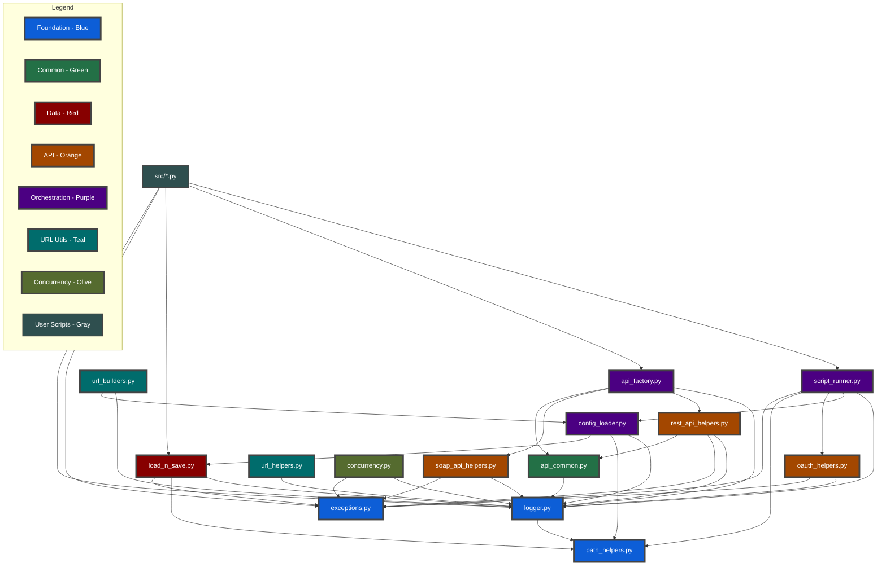

# TXO Python Template - In-Depth Guide

## Overview

This template enforces consistent patterns across all Python scripts that interact with APIs. It's designed for beginners to create production-ready code while following established best practices. The template includes advanced features like automatic token redaction, rate limiting, circuit breakers, and async operation support.

## Table of Contents
1. [Core Patterns](#core-patterns)
2. [Security Patterns](#security-patterns)
3. [API Resilience Patterns](#api-resilience-patterns)
4. [Error Handling Patterns](#error-handling-patterns)
5. [Performance Patterns](#performance-patterns)
6. [Helper Files Overview](#helper-files-overview)
7. [Script Structure Template](#script-structure-template)
8. [Configuration](#configuration)
9. [Best Practices](#best-practices)
10. [Common Pitfalls to Avoid](#common-pitfalls-to-avoid)

## Core Patterns

### 1. Mandatory Parameters Pattern

Every script requires `org_id` and `env_type` as command-line arguments:

```python
# Always first two arguments
parser.add_argument("org_id", help="Organization identifier")
parser.add_argument("env_type", help="Environment type")
```

This creates predictable file naming:
- Config: `txo-prod-config.json`
- Output: `txo-prod-report_2025-01-15T1430Z.xlsx`

### 2. Configuration Injection Pattern

Configuration and derived values are injected into a single dict:

```python
config = parse_args_and_load_config("Script description")
# Automatically contains:
# config["_org_id"] - from command line
# config["_env_type"] - from command line  
# config["_token"] - from OAuth or secrets file
```

Pass the entire config dict to functions:

```python
# GOOD
def process_data(config: Dict[str, Any]):
    org_id = config["_org_id"]

# BAD
def process_data(org_id: str, env_type: str, token: str):
    pass
```

### 3. Logger-First Pattern

Every module starts with logger setup:

```python
# utils/any_module.py  <- Path comment always first
from utils.logger import setup_logger
logger = setup_logger()

# Then use throughout
logger.info("Processing started")
logger.debug("Detailed information")
logger.error("Error occurred", exc_info=True)
```

Never use print() statements.

### 4. Tuple Context Pattern

URL builders return both URL and logging context:

```python
url, ctx = build_api_url(config, env_id, resource)
logger.info(f"{ctx} Starting API call")
# Logs: [env_id:resource] Starting API call
```

### 5. Error Philosophy Pattern

Different approaches for different data types:

```python
# Configuration data - expect it to exist (hard fail)
tenant_id = config['global']['tenant-id']  # KeyError if missing

# API responses - might be optional (soft fail)
email = response.get('email')  # None if missing
```

### 6. Path Centralization Pattern

Never construct paths manually:

```python
# GOOD
from utils.path_helpers import get_path
config_file = get_path('config', 'settings.json')

# BAD
config_file = Path('config/settings.json')
config_file = 'config/settings.json'
```

### 7. Result Tracking Pattern

Use standardized result tracking:

```python
@dataclass
class ProcessingResults:
    success: List[str] = field(default_factory=list)
    skipped: List[str] = field(default_factory=list)
    failed: List[str] = field(default_factory=list)
    
    def is_success(self) -> bool:
        return len(self.failed) == 0
```

### 8. Output File Naming Pattern

Output files include organization, environment, and UTC timestamp:

```python
from datetime import datetime, timezone

current_utc = datetime.now(timezone.utc).strftime("%Y-%m-%dT%H%MZ")
filename = f"{config['_org_id']}-{config['_env_type']}-report_{current_utc}.xlsx"
# Creates: txo-prod-report_2025-01-15T1430Z.xlsx
```

## Security Patterns

### Automatic Token Redaction

The logger automatically redacts sensitive information to prevent accidental exposure:

```python
# These patterns are automatically redacted:
logger.info(f"Token: {token}")  
# Logs: "Token: Bearer [REDACTED]"

logger.debug(f"Config: {json.dumps({'password': 'secret'})}")  
# Logs: "Config: {"password": "[REDACTED]"}"

logger.error(f"JWT: {jwt_token}")  
# Logs: "JWT: [REDACTED_JWT]"
```

Redacted patterns include:
- Bearer tokens
- JWT tokens (eyJ...)
- API keys (40+ character strings)
- Password fields in JSON
- Client secrets
- OAuth tokens

### Secure Configuration Management

Separate secrets from configuration:

```python
# config/txo-prod-config.json (can be committed)
{
  "global": {
    "api-base-url": "https://api.example.com",
    "client-id": "public-client-id"
  }
}

# config/txo-prod-config-secrets.json (gitignored)
{
  "client-secret": "secret-value",
  "az-token": "bearer-token"
}
```

## API Resilience Patterns

### Rate Limiting

Prevent hitting API rate limits:

```json
{
  "script-behavior": {
    "enable-rate-limiting": true,
    "rate-limit-per-second": 10
  }
}
```

Usage:
```python
api = create_rest_api(config)  # Rate limiting applied automatically
# Calls are automatically throttled to 10/second
```

### Circuit Breaker

Prevent cascade failures when APIs are down:

```json
{
  "script-behavior": {
    "enable-circuit-breaker": true,
    "circuit-breaker-threshold": 5,
    "circuit-breaker-timeout": 60
  }
}
```

Behavior:
- After 5 consecutive failures, circuit opens
- All requests fail immediately for 60 seconds
- After timeout, circuit attempts to close

### Async Operations (202 Accepted)

Automatically handle long-running operations:

```python
# This handles 202 responses transparently
result = api.post("/long-operation", data)
# Automatically polls Location header until complete
# Respects Retry-After header
# Times out after 5 minutes (configurable)
```

Configuration:
```json
{
  "script-behavior": {
    "async-max-wait": 300,      // Maximum wait in seconds
    "async-poll-interval": 5    // Default polling interval
  }
}
```

### Automatic Retry with Exponential Backoff

Built into all API calls:

```python
api = create_rest_api(config)
# Automatically retries on 429, 500, 502, 503, 504
# Uses exponential backoff with jitter
# Respects Retry-After headers
```

## Error Handling Patterns

### HelpfulError Pattern

Always use HelpfulError for user-facing errors:

```python
from utils.exceptions import HelpfulError

# Check for common issues
if not Path(config_file).exists():
    raise HelpfulError(
        what_went_wrong=f"Configuration file '{config_file}' not found",
        how_to_fix="Create the file in the config/ directory",
        example="Copy config/example.json and rename to "
                f"config/{org_id}-{env_type}-config.json"
    )

# Validate required fields
if 'api-url' not in config.get('global', {}):
    raise HelpfulError(
        what_went_wrong="Missing 'api-url' in configuration",
        how_to_fix="Add 'api-url' to the 'global' section",
        example='{"global": {"api-url": "https://api.example.com"}}'
    )
```

Output format:
```
❌ Problem: Configuration file 'config/txo-prod-config.json' not found

✅ Solution: Create the file in the config/ directory

📝 Example:
Copy config/example.json and rename to config/txo-prod-config.json
```

### Exception Hierarchy

Use appropriate exceptions for different scenarios:

```python
from utils.exceptions import (
    ApiAuthenticationError,  # 401 errors
    ApiTimeoutError,         # Timeout issues
    ApiRateLimitError,       # 429 errors
    ValidationError,         # Data validation
    ConfigurationError,      # Config issues
    FileOperationError,      # File I/O issues
    EntityNotFoundError      # 404 errors
)

try:
    api.get(url)
except ApiAuthenticationError:
    # Handle auth failure - maybe refresh token
    pass
except ApiTimeoutError:
    # Handle timeout - maybe retry with longer timeout
    pass
except ApiRateLimitError as e:
    # Handle rate limit - wait for retry_after
    if e.retry_after:
        time.sleep(e.retry_after)
```

## Performance Patterns

### Memory-Efficient Dataclasses

Use __slots__ for frequently instantiated classes:

```python
@dataclass
class HighVolumeData:
    __slots__ = ['id', 'value', 'timestamp']  # ~40% memory savings
    id: str
    value: float
    timestamp: datetime
```

### Connection Pooling

Sessions are automatically pooled and reused:

```python
# Sessions are cached (max 50)
api1 = create_rest_api(config, use_cache=True)
api2 = create_rest_api(config, use_cache=True)  # Reuses same session
```

### Parallel Processing

Use built-in concurrency helpers:

```python
from utils.concurrency import parallel_map, rate_limited_parallel

# Process items in parallel
result = parallel_map(process_item, items, max_workers=10)

# Rate-limited parallel processing
result = rate_limited_parallel(
    api_call, 
    items, 
    calls_per_second=5
)

# Check results
logger.info(f"Success rate: {result.success_rate:.1%}")
if result.failed:
    logger.error(f"Failed items: {len(result.failed)}")
```

### Lazy Loading

Heavy dependencies are imported only when needed:

```python
def process_excel(config: Dict[str, Any]):
    import pandas as pd  # Imported only when function is called
    return pd.read_excel(...)
```

## Resource Management Patterns

### Context Manager Pattern

Ensure proper cleanup with context managers:

```python
from utils.api_factory import ApiManager

# Automatic resource cleanup
with ApiManager(config) as manager:
    rest_api = manager.get_rest_api()
    soap_api = manager.get_soap_api()
    # Process data
    results = rest_api.get("/endpoint")
    # APIs automatically closed on exit (even on exception)

# Or use the API directly as context manager
with create_rest_api(config) as api:
    data = api.get("/endpoint")
    # Session closed automatically
```

## Helper Files Overview

### Core Utilities
- `config_loader.py` - Load and validate configuration with caching
- `logger.py` - Centralized logging with automatic token redaction
- `path_helpers.py` - Cross-platform path management
- `exceptions.py` - Custom exception hierarchy with HelpfulError

### API Utilities
- `api_factory.py` - Create configured API clients with caching
- `api_common.py` - RateLimiter, CircuitBreaker, retry utilities
- `rest_api_helpers.py` - REST client with async ops, pagination
- `soap_api_helpers.py` - SOAP API operations
- `oauth_helpers.py` - OAuth 2.0 authentication with token caching

### Data Utilities
- `load_n_save.py` - File I/O operations with multiple formats
- `url_builders.py` - URL construction with logging context
- `url_helpers.py` - URL manipulation and OData filters

### Script Utilities
- `script_runner.py` - Standard script initialization with validation
- `concurrency.py` - Parallel processing with progress tracking

## Script Structure Template

```python
# src/my_script.py
"""
Script description here.

Usage:
    python my_script.py <org_id> <env_type>
"""

from datetime import datetime, timezone
from typing import Dict, Any, List

from utils.logger import setup_logger
from utils.script_runner import parse_args_and_load_config
from utils.load_n_save import TxoDataHandler
from utils.api_factory import create_rest_api
from utils.exceptions import HelpfulError, ApiOperationError

logger = setup_logger()
data_handler = TxoDataHandler()

def validate_config(config: Dict[str, Any]) -> None:
    """Validate required configuration."""
    if 'endpoints' not in config:
        raise HelpfulError(
            what_went_wrong="Missing 'endpoints' section in config",
            how_to_fix="Add endpoints configuration",
            example='{"endpoints": {"api": "https://api.example.com"}}'
        )

def process_data(config: Dict[str, Any]) -> List[Dict[str, Any]]:
    """Main processing logic."""
    api = create_rest_api(config)
    
    try:
        endpoint = config['endpoints']['api']
        response = api.get(endpoint)
        return response.get('items', [])
    except ApiOperationError as e:
        logger.error(f"API call failed: {e}")
        raise HelpfulError(
            what_went_wrong=f"Failed to fetch data: {e}",
            how_to_fix="Check API endpoint and authentication",
            example="Verify the endpoint URL and token are correct"
        )

def main():
    """Entry point."""
    config = parse_args_and_load_config("Script description")
    
    org_id = config['_org_id']
    env_type = config['_env_type']
    
    logger.info(f"Starting process for {org_id}-{env_type}")
    
    try:
        # Validate
        validate_config(config)
        
        # Process
        data = process_data(config)
        logger.info(f"Processed {len(data)} items")
        
        # Save
        utc = datetime.now(timezone.utc).strftime("%Y-%m-%dT%H%MZ")
        filename = f"{org_id}-{env_type}-output_{utc}.json"
        
        output_path = data_handler.save(data, "output", filename)
        logger.info(f"✅ Saved to: {output_path}")
        
    except HelpfulError:
        raise  # Let script_runner display the helpful message
    except Exception as e:
        logger.error(f"Unexpected error: {e}", exc_info=True)
        raise HelpfulError(
            what_went_wrong=f"Process failed: {str(e)}",
            how_to_fix="Check logs for details",
            example="Run with --debug flag for more information"
        )
        
if __name__ == "__main__":
    main()
```

## Configuration

### Basic Configuration Structure

```json
{
  "global": {
    "api-base-url": "https://api.example.com",
    "tenant-id": "your-tenant",
    "client-id": "your-client-id",
    "oauth-scope": "https://api.example.com/.default"
  },
  "script-behavior": {
    "api-delay-seconds": 1,
    "enable-rate-limiting": true,
    "rate-limit-per-second": 10,
    "enable-circuit-breaker": true,
    "circuit-breaker-threshold": 5,
    "circuit-breaker-timeout": 60,
    "api-timeouts": {
      "rest-timeout-seconds": 60,
      "soap-timeout-seconds": 120,
      "wsdl-timeout-seconds": 60,
      "max-retries": 3,
      "backoff-factor": 2.0,
      "async-max-wait": 300,
      "async-poll-interval": 5
    },
    "jitter": {
      "min-factor": 0.5,
      "max-factor": 1.5
    }
  },
  "endpoints": {
    "api": "https://api.example.com/v1",
    "auth": "https://auth.example.com/token"
  }
}
```

### Secrets Configuration (gitignored)

```json
{
  "client-secret": "your-oauth-secret",
  "az-token": "fallback-bearer-token",
  "api-key": "optional-api-key"
}
```

### Environment Variables (.env file)

```bash
# Optional: Override config with environment variables
API_BASE_URL=https://api.example.com
CLIENT_ID=your-client-id
CLIENT_SECRET=your-secret
```

## Best Practices

1. **Always validate input** - Check config keys exist before accessing
2. **Use HelpfulError** - Provide clear, actionable error messages
3. **Log extensively** - DEBUG for details, INFO for milestones, ERROR for issues
4. **Handle errors gracefully** - Use specific exceptions with try/except
5. **Document functions** - Include docstrings with type hints
6. **Keep scripts focused** - One main purpose per script
7. **Reuse helpers** - Don't duplicate functionality
8. **Test locally first** - Use test/demo environment before production
9. **Use context managers** - For resource cleanup
10. **Monitor performance** - Use __slots__ for high-volume data

## Common Pitfalls to Avoid

1. **Using print() instead of logger** - Always use logger for output
2. **Hardcoding paths** - Use path_helpers.get_path()
3. **Passing individual parameters** - Pass config dict instead
4. **Missing type hints** - Always include for better IDE support
5. **Not validating configuration** - Check required keys exist
6. **Constructing URLs manually** - Use url_helpers
7. **Ignoring tuple context pattern** - Always unpack (url, context)
8. **Not using HelpfulError** - Don't show stack traces to users
9. **Logging sensitive tokens directly** - They're redacted automatically
10. **Not handling 202 Accepted** - Async operations need polling
11. **Creating too many API instances** - Use caching with use_cache=True
12. **Ignoring rate limits** - Enable rate limiting in config
13. **Not cleaning up resources** - Use context managers
14. **Using synchronous code for parallel tasks** - Use concurrency helpers

## Advanced Patterns

### Custom Retry Logic

For special retry requirements:

```python
from utils.api_common import manual_retry

# Custom retry with specific handling
@manual_retry(max_retries=5, backoff=3.0)
def risky_operation():
    # Operation that might fail
    pass
```

### OData Query Building

```python
from utils.url_helpers import build_odata_filter

# Build complex OData filters
filter_str = build_odata_filter({
    "status": "eq 'active'",
    "created": "gt 2024-01-01",
    "value": "ge 100"
})
# Creates: $filter=status eq 'active' and created gt 2024-01-01 and value ge 100
```

### Batch Processing

```python
from utils.concurrency import batch_process

# Process in batches to avoid memory issues
result = batch_process(
    process_batch,
    large_dataset,
    batch_size=1000
)
```

## Debugging Tips

1. **Enable debug logging**: Run with `--debug` flag
2. **Check log files**: Debug logs go to `logs/app_YYYY-MM-DD.log`
3. **Validate JSON**: Use online JSON validators for config files
4. **Test API manually**: Use Postman/curl to verify endpoints
5. **Use helpful errors**: They guide you to the solution
6. **Check rate limits**: Look for 429 errors in logs
7. **Monitor memory**: Use __slots__ for high-volume processing
8. **Profile performance**: Use cProfile for bottlenecks

## Module Dependencies

Understanding the dependency structure helps with debugging and refactoring:


More details i the [Module Dependency Diagram](module-dependency-diagram) file.

### Refactoring Order

When updating helper files, follow this dependency order:
1. **exceptions.py** (no dependencies)
2. **path_helpers.py** (foundation)
3. **logger.py** (depends on path_helpers)
4. **api_common.py** (depends on logger)
5. **load_n_save.py** (depends on exceptions, logger, path_helpers)
6. **oauth_helpers.py** (depends on logger, exceptions)
7. **rest_api_helpers.py** (depends on api_common, exceptions, logger)
8. **config_loader.py** (depends on logger, path_helpers, load_n_save)
9. **api_factory.py** (depends on rest_api, api_common, logger)
10. **script_runner.py** (top level orchestration)

## For More Information

- See `ai/decided/adr-records.md` for architecture decisions
- Upload `ai/prompts/txo-python-template-v3.0.xml` to AI for assistance
- Check example scripts in `src/` directory
- Review helper module docstrings for detailed usage
- See JSON schemas in `schemas/` for configuration structure
- Use `ai/prompts/txo-refactoring-prompt-v1.0.xml` when updating existing projects