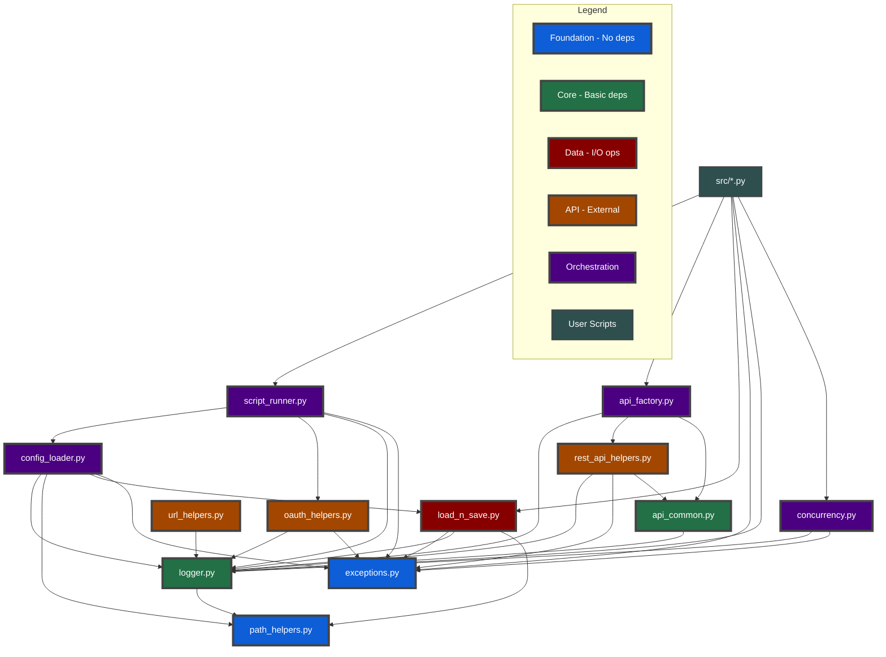
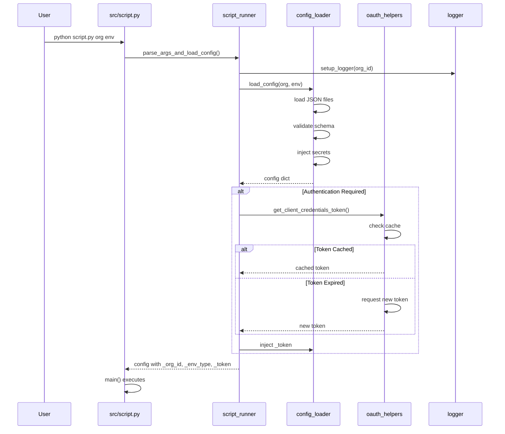
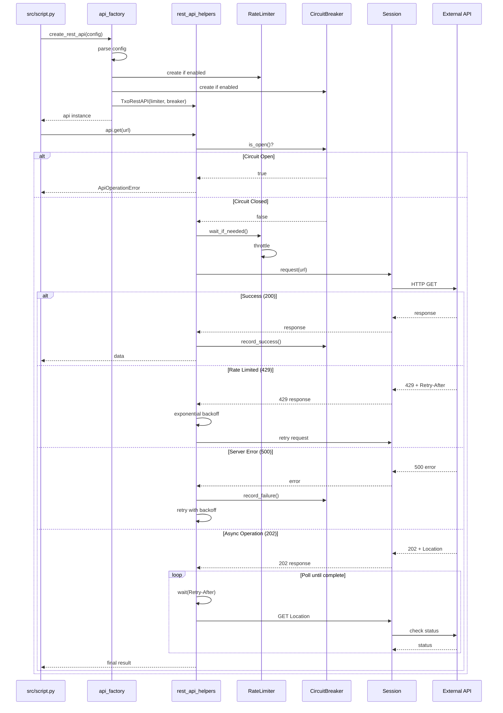
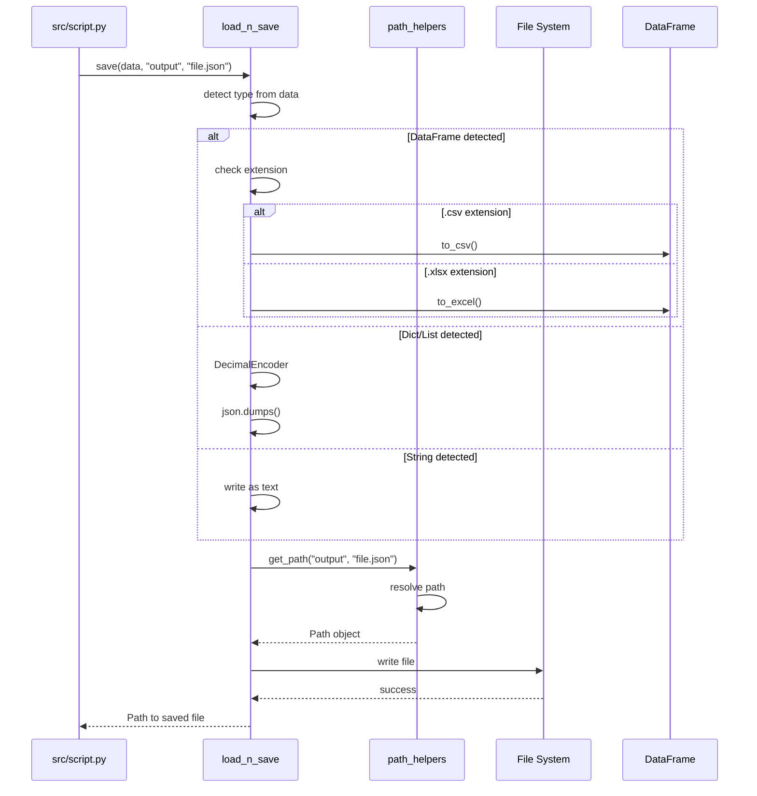

# Module Dependency Diagram

## Architecture Overview

The TXO Python Template v2.1 follows a layered architecture with clear dependency rules. Understanding these dependencies is crucial for maintenance and refactoring.

## Dependency Layers

### Layer 1: Foundation (No Dependencies)
- `exceptions.py` - Custom exception hierarchy
- `path_helpers.py` - Path management utilities

### Layer 2: Core Services 
- `logger.py` - Depends on: path_helpers
- `api_common.py` - Depends on: logger

### Layer 3: Data & I/O
- `load_n_save.py` - Depends on: exceptions, logger, path_helpers

### Layer 4: API Implementation
- `oauth_helpers.py` - Depends on: logger, exceptions
- `rest_api_helpers.py` - Depends on: logger, exceptions, api_common
- `url_helpers.py` - Depends on: logger

### Layer 5: Orchestration
- `config_loader.py` - Depends on: logger, path_helpers, load_n_save, exceptions
- `api_factory.py` - Depends on: logger, rest_api_helpers, api_common
- `script_runner.py` - Depends on: config_loader, oauth_helpers, logger, exceptions

### Layer 6: User Scripts
- `src/*.py` - Depends on: script_runner, api_factory, load_n_save, exceptions, logger

## Visual Dependency Graph



## Common Operation Sequences

### Script Initialization Sequence



### API Call with Resilience Features



### File Save with Type Detection



## Refactoring Order

When updating the template, follow this dependency order to avoid breaking changes:

1. **Foundation** (no dependencies)
   - exceptions.py
   - path_helpers.py

2. **Core Services** (minimal dependencies)
   - logger.py (depends on path_helpers)
   - api_common.py (depends on logger)

3. **Data Layer** (foundation + core)
   - load_n_save.py

4. **API Implementation** (all previous)
   - oauth_helpers.py
   - rest_api_helpers.py
   - url_helpers.py

5. **Orchestration** (all previous)
   - config_loader.py
   - api_factory.py
   - concurrency.py
   - script_runner.py

6. **User Scripts** (everything)
   - Update last after all utilities are working

## Key Design Principles

### 1. Unidirectional Dependencies
- Lower layers never depend on higher layers
- Foundation modules have zero dependencies
- User scripts can use everything

### 2. Single Responsibility
Each module has one clear purpose:
- `logger.py` - Only logging
- `path_helpers.py` - Only path management
- `api_factory.py` - Only API creation

### 3. Dependency Injection
Configuration and dependencies are injected, not hardcoded:
```python
# Good - injected
def process(config: Dict[str, Any]):
    api = create_rest_api(config)

# Bad - hardcoded
def process():
    api = create_rest_api(load_my_config())
```

### 4. Fail Fast Philosophy
All required configuration uses hard-fail:
```python
# Good - fails immediately if missing
url = config['global']['api-url']

# Bad - silent failure
url = config.get('global', {}).get('api-url', 'default')
```

## Testing Dependencies

To test a module in isolation, you only need its dependencies:

```bash
# Test exceptions.py - no dependencies needed
python -c "from utils.exceptions import HelpfulError; raise HelpfulError('test', 'fix', 'example')"

# Test logger.py - needs path_helpers
python -c "from utils.logger import setup_logger; logger = setup_logger(); logger.info('test')"

# Test api_factory.py - needs many dependencies
# Better to use test_v2_features.py which tests everything
```

## Common Circular Dependency Issues

### Problem Areas to Avoid

1. **Config in Logger**
   - Don't make logger depend on config_loader
   - Logger should work with minimal setup

2. **API in Exceptions**
   - Exceptions shouldn't know about API details
   - Keep exceptions generic

3. **Script Runner in Helpers**
   - Helper modules shouldn't import script_runner
   - Keep helpers independent

### Signs of Circular Dependencies

- ImportError at module level
- Functions that import inside themselves
- Modules that import each other

### Resolution Strategy

1. Move shared code to a lower layer
2. Use dependency injection instead of imports
3. Create a new intermediate module
4. Use type hints with string literals for forward references

## Performance Considerations

### Import Cost
Modules are imported in order of dependency. Heavy modules are loaded lazily:

```python
# Good - lazy import
def process_excel():
    import pandas as pd  # Only loaded when needed
    
# Bad - always imported
import pandas as pd  # Loaded even if not used
```

### Singleton Patterns
Several modules use singleton patterns for efficiency:
- `logger.py` - Single logger instance
- `config_loader.py` - Cached configuration
- `api_factory.py` - Optional API instance caching

### Connection Pooling
API modules reuse connections:
- `rest_api_helpers.py` - SessionManager with LRU cache
- Maximum 50 sessions cached
- Thread-safe implementation

## Version Compatibility

### v2.1 Breaking Changes
- Config structure is nested (rate-limiting, circuit-breaker as objects)
- All config access uses hard-fail
- save_json() → save() with type detection
- MinimalRestAPI → TxoRestAPI

### Backward Compatibility
Where possible, v2.1 maintains compatibility:
- Old flat config can be migrated
- Helper functions still work
- Core patterns unchanged

## Troubleshooting

### Module Not Found
```python
ImportError: cannot import name 'X' from 'utils.Y'
```
- Check if module exists
- Verify no typos in import
- Ensure dependencies are installed

### Circular Import
```python
ImportError: cannot import name 'X' from partially initialized module
```
- Check dependency graph above
- Move shared code to lower layer
- Use lazy imports

### Type Errors
```python
TypeError: X() takes no arguments
```
- Check if using v2.1 syntax
- Verify config structure matches
- Update to new class names

## Future Architecture Considerations

### Potential Improvements
1. **Plugin System** - Dynamic helper loading
2. **Async Support** - asyncio for I/O operations
3. **Caching Layer** - Redis/memcached integration
4. **Message Queue** - For long-running operations
5. **Metrics Collection** - Performance monitoring

### Maintaining the Architecture
1. Keep dependencies unidirectional
2. Document any new modules in this diagram
3. Add tests for new dependencies
4. Update refactoring order when adding modules
5. Consider impact on all layers when changing interfaces