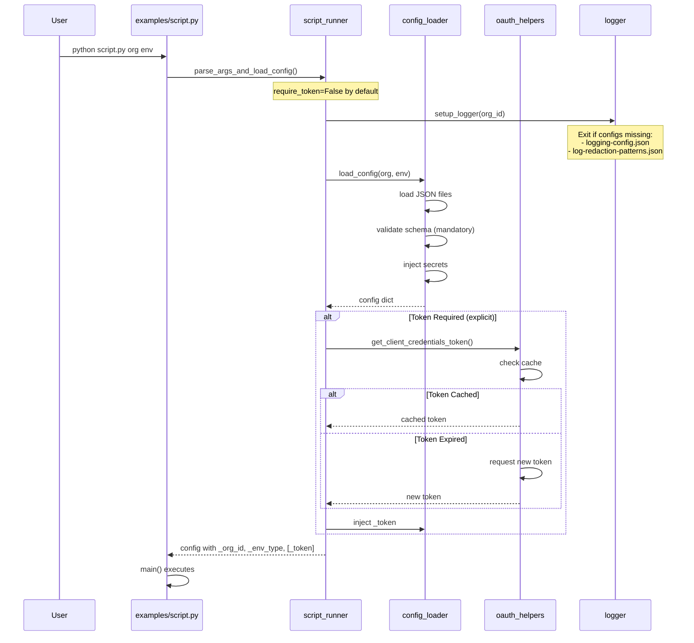
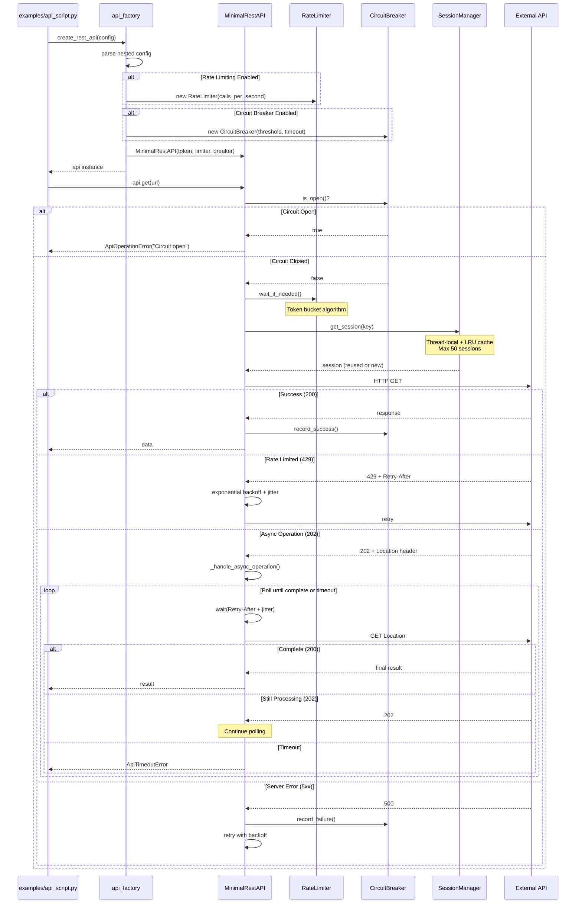
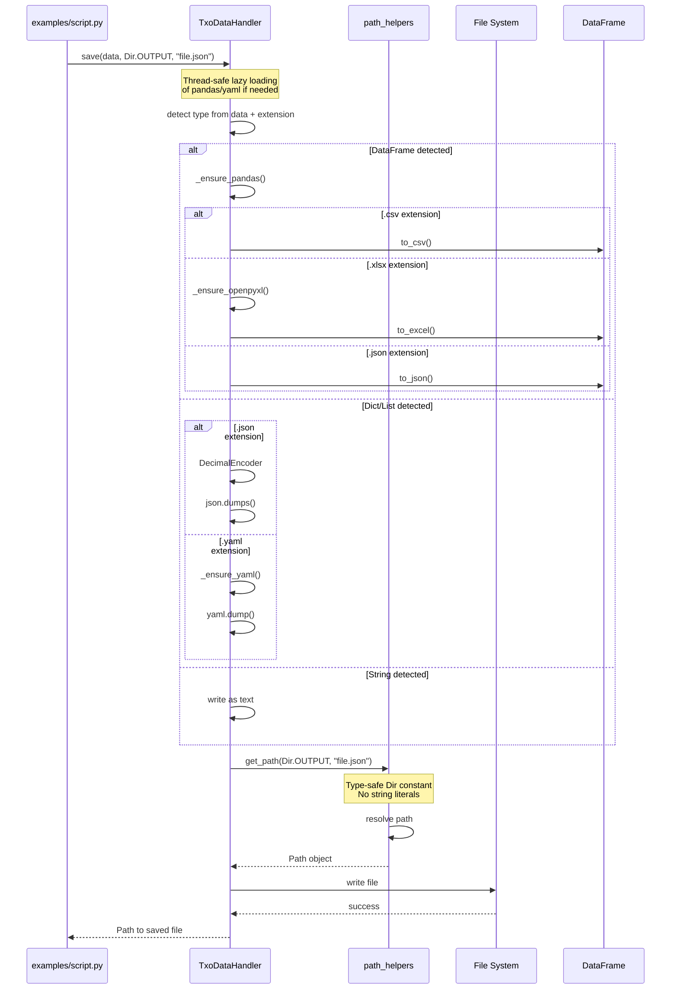

# Module Dependency Diagram v3.0

## Architecture Overview

The TXO Python Template v3.0 follows a layered architecture with clear dependency rules. The v3.0 release adds type-safe directory constants, integrated rate limiting, circuit breakers, and enhanced error handling with context.

## Dependency Layers

### Layer 1: Foundation (No Dependencies)
- `exceptions.py` - Custom exception hierarchy with `ErrorContext`
- `path_helpers.py` - Path management with `Dir` constants

### Layer 2: Core Services 
- `logger.py` - Depends on: path_helpers
  - Contains: `TxoLogger`, `TokenRedactionFilter`, `ContextFilter`
- `api_common.py` - Depends on: logger
  - Contains: `RateLimiter`, `CircuitBreaker`, retry utilities

### Layer 3: Data & I/O
- `load_n_save.py` - Depends on: exceptions, logger, path_helpers
  - Thread-safe lazy loading
  - Universal save() method

### Layer 4: API Implementation
- `oauth_helpers.py` - Depends on: logger, exceptions
- `rest_api_helpers.py` - Depends on: logger, exceptions, api_common
  - Contains: `MinimalRestAPI`, `SessionManager`, `RestOperationResult`
- `soap_api_helpers.py` - Depends on: logger, exceptions, api_common
- `url_helpers.py` - Depends on: logger

### Layer 5: Orchestration
- `config_loader.py` - Depends on: logger, path_helpers, load_n_save, exceptions
- `api_factory.py` - Depends on: logger, rest_api_helpers, soap_api_helpers, api_common
  - Creates: `RateLimiter`, `CircuitBreaker` instances
- `script_runner.py` - Depends on: config_loader, oauth_helpers, logger, exceptions
  - Token optional by default in v3.0

### Layer 6: User Scripts
- `examples/*.py` - Depends on: script_runner, api_factory, load_n_save, exceptions, logger, path_helpers

## Visual Dependency Graph

```mermaid
graph TD
    %% Color scheme for different layers
    classDef foundation fill:#0D5ED7,stroke:#444,stroke-width:4px,color:#fff
    classDef core fill:#237046,stroke:#444,stroke-width:4px,color:#fff
    classDef data fill:#870000,stroke:#444,stroke-width:4px,color:#fff
    classDef api fill:#A34700,stroke:#444,stroke-width:4px,color:#fff
    classDef orchestration fill:#4B0082,stroke:#444,stroke-width:4px,color:#fff
    classDef user fill:#2F4F4F,stroke:#444,stroke-width:2px,color:#fff

    %% Foundation Layer (Blue)
    exceptions[exceptions.py<br/>ErrorContext]:::foundation
    path_helpers[path_helpers.py<br/>Dir constants]:::foundation
    
    %% Core Services (Green)
    logger[logger.py<br/>TokenRedactionFilter<br/>ContextFilter]:::core
    api_common[api_common.py<br/>RateLimiter<br/>CircuitBreaker]:::core
    
    %% Data Layer (Red)
    load_n_save[load_n_save.py<br/>Universal save()]:::data
    
    %% API Implementation (Orange)
    rest_api_helpers[rest_api_helpers.py<br/>SessionManager]:::api
    soap_api_helpers[soap_api_helpers.py]:::api
    oauth_helpers[oauth_helpers.py]:::api
    url_helpers[url_helpers.py]:::api
    
    %% Orchestration (Purple)
    config_loader[config_loader.py]:::orchestration
    api_factory[api_factory.py<br/>ApiManager]:::orchestration
    script_runner[script_runner.py<br/>Token optional]:::orchestration
    concurrency[concurrency.py]:::orchestration
    
    %% User Scripts (Gray)
    user_script[examples/*.py]:::user
    
    %% Dependencies
    logger --> path_helpers
    
    api_common --> logger
    
    load_n_save --> exceptions
    load_n_save --> logger
    load_n_save --> path_helpers
    
    oauth_helpers --> logger
    oauth_helpers --> exceptions
    
    rest_api_helpers --> logger
    rest_api_helpers --> exceptions
    rest_api_helpers --> api_common
    
    soap_api_helpers --> logger
    soap_api_helpers --> exceptions
    soap_api_helpers --> api_common
    
    url_helpers --> logger
    
    config_loader --> logger
    config_loader --> path_helpers
    config_loader --> load_n_save
    config_loader --> exceptions
    
    api_factory --> logger
    api_factory --> rest_api_helpers
    api_factory --> soap_api_helpers
    api_factory --> api_common
    
    concurrency --> logger
    concurrency --> exceptions
    
    script_runner --> config_loader
    script_runner --> oauth_helpers
    script_runner --> logger
    script_runner --> exceptions
    
    user_script --> script_runner
    user_script --> api_factory
    user_script --> load_n_save
    user_script --> exceptions
    user_script --> logger
    user_script --> path_helpers
    user_script --> concurrency

    %% Legend
    subgraph Legend
        L1[Foundation - No deps]:::foundation
        L2[Core - Basic deps]:::core
        L3[Data - I/O ops]:::data
        L4[API - External]:::api
        L5[Orchestration]:::orchestration
        L6[User Scripts]:::user
    end
```

## Key v3.0 Components

### New Classes and Features

#### path_helpers.py
```python
class Dir(str, Enum):
    """Type-safe directory constants."""
    CONFIG = "config"
    DATA = "data"
    OUTPUT = "output"
    LOGS = "logs"
    # ... more directories
```

#### exceptions.py
```python
@dataclass
class ErrorContext:
    """Structured error context for debugging."""
    __slots__ = ['operation', 'resource', 'details']
    operation: Optional[str] = None
    resource: Optional[str] = None
    details: Optional[Dict[str, Any]] = None
```

#### logger.py
```python
class TokenRedactionFilter(logging.Filter):
    """Redacts tokens including underscore-prefixed metadata."""
    # Handles _token, _password, _client_secret, etc.

class ContextFilter(logging.Filter):
    """Adds org_id and elapsed time to logs."""
```

#### api_common.py
```python
class RateLimiter:
    """Token bucket rate limiting."""
    def wait_if_needed(self) -> None: ...

class CircuitBreaker:
    """Circuit breaker pattern."""
    def is_open(self) -> bool: ...
    def record_success(self) -> None: ...
    def record_failure(self) -> None: ...
```

#### rest_api_helpers.py
```python
class SessionManager:
    """Thread-safe session management with LRU cache."""
    _max_cache_size = 50  # Prevents unbounded growth
    
class MinimalRestAPI:
    """Enhanced with rate limiting and circuit breaker."""
    def __init__(self, token, rate_limiter=None, circuit_breaker=None): ...
    def _handle_async_operation(self, response): ...  # 202 Accepted
```

## Common Operation Sequences

### Script Initialization (v3.0)



### API Call with v3.0 Resilience



### Universal Save with Type Detection



## Refactoring Order

When updating the template, follow this dependency order:

### Phase 1: Foundation (no dependencies)
1. `exceptions.py` - Add ErrorContext, new exception types
2. `path_helpers.py` - Add Dir constants

### Phase 2: Core Services (minimal dependencies)
3. `logger.py` - Add TokenRedactionFilter, ContextFilter
4. `api_common.py` - Add RateLimiter, CircuitBreaker

### Phase 3: Data Layer (foundation + core)
5. `load_n_save.py` - Add universal save(), thread-safe loading

### Phase 4: API Implementation (all previous)
6. `oauth_helpers.py` - Update for v3.0
7. `rest_api_helpers.py` - Add SessionManager, async handling
8. `soap_api_helpers.py` - Update for v3.0
9. `url_helpers.py` - Update for v3.0

### Phase 5: Orchestration (all previous)
10. `config_loader.py` - Mandatory validation
11. `api_factory.py` - Create rate limiters, circuit breakers
12. `concurrency.py` - Update for v3.0
13. `script_runner.py` - Token optional by default

### Phase 6: User Scripts (everything)
14. Update scripts to use Dir constants
15. Remove unnecessary require_token=True

## Key Design Principles

### 1. Unidirectional Dependencies
- Lower layers never depend on higher layers
- Foundation modules have zero dependencies
- User scripts can use everything

### 2. Single Responsibility
Each module has one clear purpose:
- `logger.py` - Only logging and redaction
- `path_helpers.py` - Only path management and Dir constants
- `api_factory.py` - Only API creation and configuration

### 3. Dependency Injection
Configuration and dependencies are injected:
```python
# Good - injected
def process(config: Dict[str, Any]):
    api = create_rest_api(config)  # Config injected

# Bad - hardcoded
def process():
    config = load_my_config()  # Hidden dependency
    api = create_rest_api(config)
```

### 4. Fail Fast Philosophy
Required configuration uses hard-fail:
```python
# Good - fails immediately if missing
url = config['global']['api-url']  # KeyError if missing

# Bad - silent failure
url = config.get('global', {}).get('api-url', 'default')
```

### 5. Type Safety (v3.0)
Use type-safe constants instead of strings:
```python
# Good - type-safe
from utils.path_helpers import Dir
data = load(Dir.CONFIG, 'file.json')

# Bad - error-prone strings
data = load('config', 'file.json')
```

## Testing Dependencies

### Unit Testing Individual Modules

```bash
# Test exceptions.py - no dependencies
python -c "
from utils.exceptions import HelpfulError, ErrorContext
context = ErrorContext(operation='test')
raise HelpfulError('test', 'fix', 'example')
"

# Test path_helpers.py - no dependencies
python -c "
from utils.path_helpers import Dir, get_path
print(f'Dir.CONFIG = {Dir.CONFIG}')
print(f'Path = {get_path(Dir.CONFIG, \"test.json\")}'')
"

# Test logger.py - needs path_helpers
python -c "
from utils.logger import setup_logger
logger = setup_logger()
logger.info('Test with _token: [should be redacted]')
"

# Test api_common.py - needs logger
python -c "
from utils.api_common import RateLimiter, CircuitBreaker
limiter = RateLimiter(calls_per_second=10)
breaker = CircuitBreaker(failure_threshold=5)
print(f'Circuit open: {breaker.is_open()}')
"
```

### Integration Testing
```bash
# Test v3.0 features
python tests/test_features.py demo test

# Test example script
python examples/try_me_script.py demo test
```

## Common Circular Dependency Issues

### Problem Areas to Avoid

1. **Config in Logger**
   - Don't make logger depend on config_loader
   - Logger uses its own JSON loading

2. **API in Exceptions**
   - Exceptions shouldn't import API modules
   - Keep exceptions generic with ErrorContext

3. **Script Runner in Helpers**
   - Helper modules shouldn't import script_runner
   - Use dependency injection instead

### Signs of Circular Dependencies
- `ImportError` at module level
- Functions that import inside themselves
- Modules that import each other
- `cannot import name 'X' from partially initialized module`

### Resolution Strategy
1. Move shared code to a lower layer
2. Use dependency injection instead of imports
3. Create a new intermediate module
4. Use type hints with string literals: `'ClassName'`

## Performance Considerations

### Import Cost
Heavy modules are loaded lazily:

```python
class TxoDataHandler:
    def __init__(self):
        self._pd = None  # Lazy load pandas
        self._yaml = None  # Lazy load yaml
        self._import_lock = threading.Lock()
    
    def _ensure_pandas(self):
        if self._pd is None:
            with self._import_lock:
                if self._pd is None:  # Double-check
                    import pandas as pd
                    self._pd = pd
```

### Singleton Patterns
Several modules use singleton patterns:
- `logger.py` - Single TxoLogger instance
- `config_loader.py` - Cached configuration
- `api_factory.py` - Optional API instance caching

### Connection Pooling
API modules reuse connections efficiently:
- `SessionManager` - Thread-local + shared cache
- Maximum 50 sessions (LRU eviction)
- Automatic cleanup on exit

### Rate Limiting Performance
- Token bucket algorithm (smooth, not bursty)
- Minimal overhead when disabled
- Thread-safe implementation

## Version Compatibility

### v3.0 Breaking Changes
- **Dir constants required** - No string literals for directories
- **Token optional by default** - Was required in v2.x
- **Universal save() method** - Replaces save_json(), save_excel()
- **Nested configuration** - rate-limiting and circuit-breaker as objects
- **Mandatory config files** - No defaults, script exits if missing

### Backward Compatibility
Limited compatibility maintained:
- Old API still works with deprecation warnings
- Config migration scripts available
- Core patterns unchanged

### v2.x → v3.0 Migration
```python
# Update imports
from utils.path_helpers import Dir  # NEW

# Update all path usage
# OLD: data_handler.load_json('config', 'file.json')
# NEW: data_handler.load_json(Dir.CONFIG, 'file.json')

# Update token requirement
# OLD: parse_args_and_load_config("Script")  # Token required
# NEW: parse_args_and_load_config("Script")  # Token optional
# NEW: parse_args_and_load_config("Script", require_token=True)  # Explicit

# Update save methods
# OLD: data_handler.save_json(data, 'output', 'file.json')
# NEW: data_handler.save(data, Dir.OUTPUT, 'file.json')
```

## Troubleshooting

### Module Not Found
```python
ImportError: cannot import name 'Dir' from 'utils.path_helpers'
```
- Ensure using v3.0 of template
- Check path_helpers.py has Dir class

### Circular Import
```python
ImportError: cannot import name 'X' from partially initialized module
```
- Check dependency graph above
- Move shared code to lower layer
- Use lazy imports in functions

### Type Errors
```python
TypeError: expected Dir, got str
```
- Update to use Dir constants
- Import Dir from path_helpers

### Config Structure Errors
```python
KeyError: 'rate-limiting'
```
- Update config to nested structure
- Check against schema

## Future Architecture Considerations

### Potential Improvements
1. **Async/Await Support** - Full asyncio implementation
2. **Plugin System** - Dynamic helper loading
3. **Distributed Tracing** - OpenTelemetry integration
4. **Message Queue** - Celery/RabbitMQ for long operations
5. **Metrics Collection** - Prometheus integration
6. **GraphQL Support** - In addition to REST/SOAP

### Maintaining the Architecture
1. Keep dependencies unidirectional
2. Document new modules in this diagram
3. Add tests for new dependencies
4. Update refactoring order for new modules
5. Consider performance impact
6. Maintain type safety with Dir constants
7. Follow fail-fast philosophy

## Module Interface Contracts

### Foundation Layer
- **No external dependencies**
- **No I/O operations**
- **Pure Python only**

### Core Services Layer
- **Minimal dependencies (foundation only)**
- **No business logic**
- **Reusable utilities**

### Data Layer
- **Handle all I/O operations**
- **Type detection and conversion**
- **Thread-safe operations**

### API Layer
- **Protocol-specific implementations**
- **Resilience patterns built-in**
- **Connection management**

### Orchestration Layer
- **Compose lower layers**
- **Configuration management**
- **High-level workflows**

### User Scripts Layer
- **Use all available layers**
- **Business logic here**
- **No framework modifications**