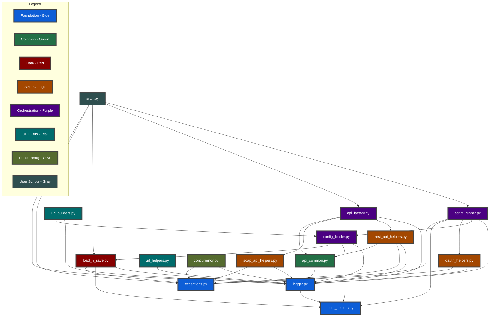
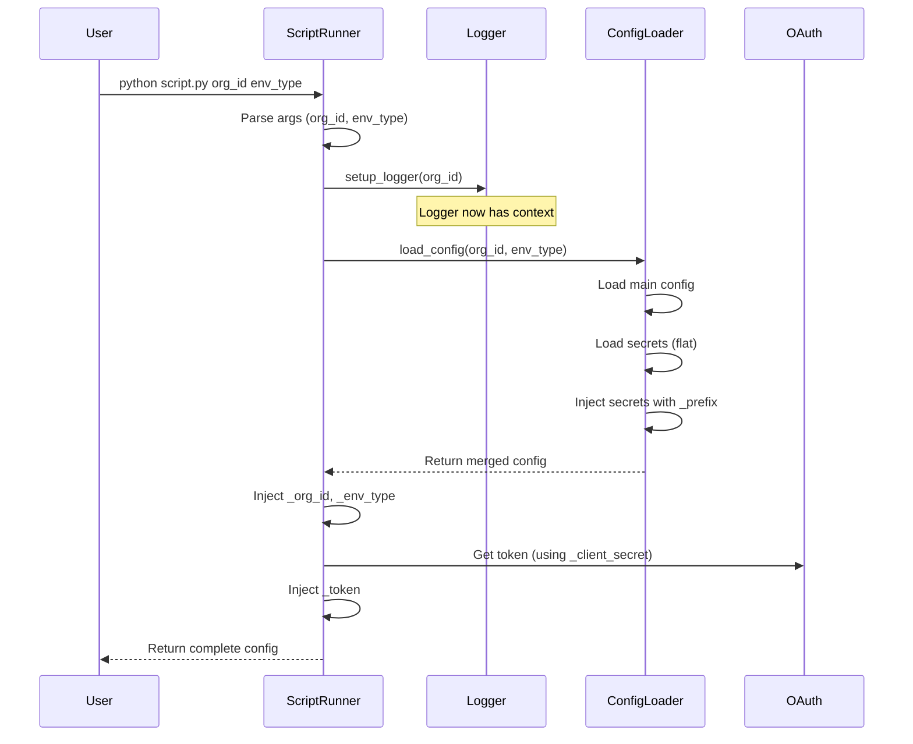

# Module Dependency Diagram

## Helper Module Dependencies



## Helper Module Flow



## Dependency Levels

### Level 0 - No Dependencies
- **exceptions.py**: Base exception classes (no utils dependencies)

### Level 1 - Foundation
- **logger.py**: Depends on path_helpers
- **path_helpers.py**: No utils dependencies (potential circular dependency with logger needs investigation)

### Level 2 - Common Utilities
- **api_common.py**: Depends on logger

### Level 3 - Data & Authentication
- **load_n_save.py**: Depends on logger, path_helpers, exceptions
- **oauth_helpers.py**: Depends on logger, exceptions
- **config_loader.py**: Depends on logger, path_helpers, load_n_save
- **url_helpers.py**: Depends on logger

### Level 4 - API Implementation & Utilities
- **rest_api_helpers.py**: Depends on logger, exceptions, api_common
- **soap_api_helpers.py**: Depends on logger, exceptions
- **url_builders.py**: Depends on logger, config_loader
- **concurrency.py**: Depends on logger, exceptions

### Level 5 - Orchestration
- **api_factory.py**: Depends on logger, rest_api_helpers, soap_api_helpers, api_common

### Level 6 - Script Runner
- **script_runner.py**: Depends on logger, config_loader, oauth_helpers, path_helpers, exceptions

### Level 7 - User Scripts
- **src/*.py**: Typically depend on script_runner, api_factory, load_n_save, exceptions, logger

## Potential Issues Detected

### ⚠️ Circular Dependency Risk
- **logger.py** imports **path_helpers** (for get_path)
- If **path_helpers** imports **logger**, this creates a circular dependency
- **Solution**: path_helpers should not import logger, or use lazy import

## Refactoring Order

Based on dependencies, update in this order:

1. **exceptions.py** (no dependencies)
2. **path_helpers.py** (check for circular dependency first)
3. **logger.py**
4. **api_common.py**
5. **load_n_save.py**, **oauth_helpers.py**, **url_helpers.py**
6. **config_loader.py**
7. **rest_api_helpers.py**, **soap_api_helpers.py**, **concurrency.py**
8. **url_builders.py**
9. **api_factory.py**
10. **script_runner.py**

## Import Graph for Quick Reference

```python
# Foundation (no imports from utils)
exceptions.py → None

# Foundation with dependencies
path_helpers.py → (check for logger import - potential circular)
logger.py → path_helpers

# Common utilities
api_common.py → logger

# Data layer
load_n_save.py → logger, path_helpers, exceptions

# Authentication
oauth_helpers.py → logger, exceptions

# API implementations
rest_api_helpers.py → logger, exceptions, api_common
soap_api_helpers.py → logger, exceptions

# URL utilities
url_helpers.py → logger
url_builders.py → logger, config_loader

# Configuration
config_loader.py → logger, path_helpers, load_n_save

# Orchestration
api_factory.py → logger, rest_api_helpers, soap_api_helpers, api_common
concurrency.py → logger, exceptions

# Top level
script_runner.py → logger, config_loader, oauth_helpers, path_helpers, exceptions
```