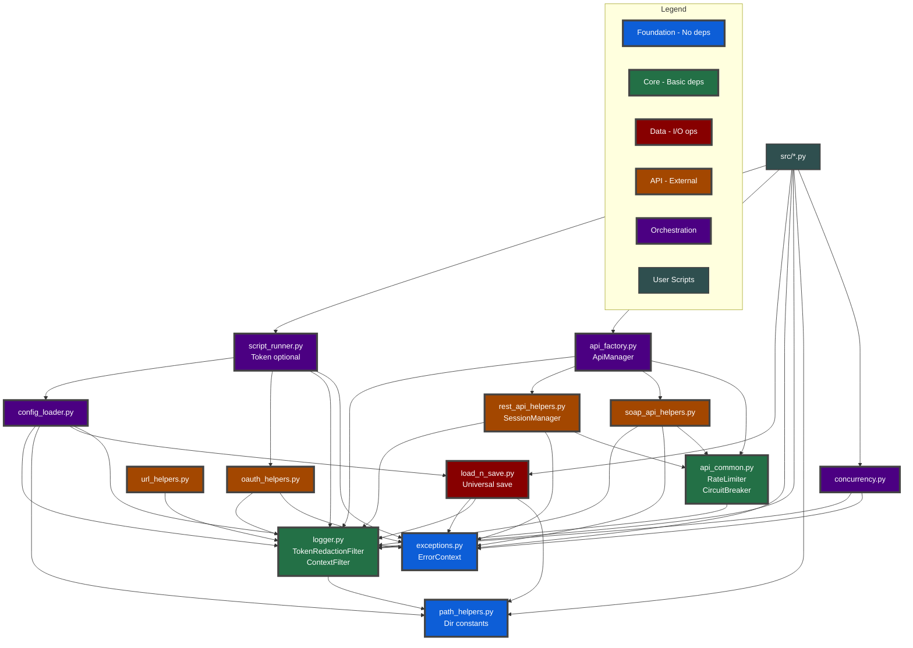
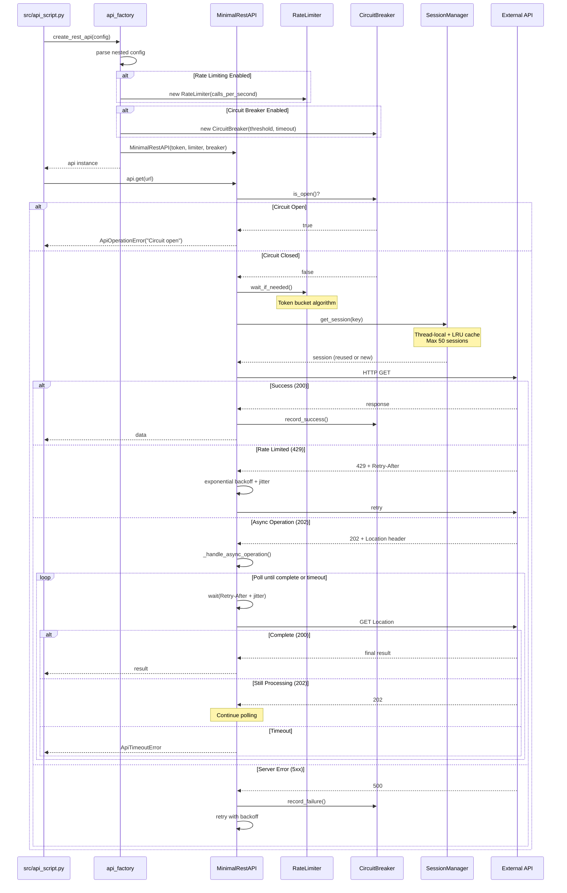
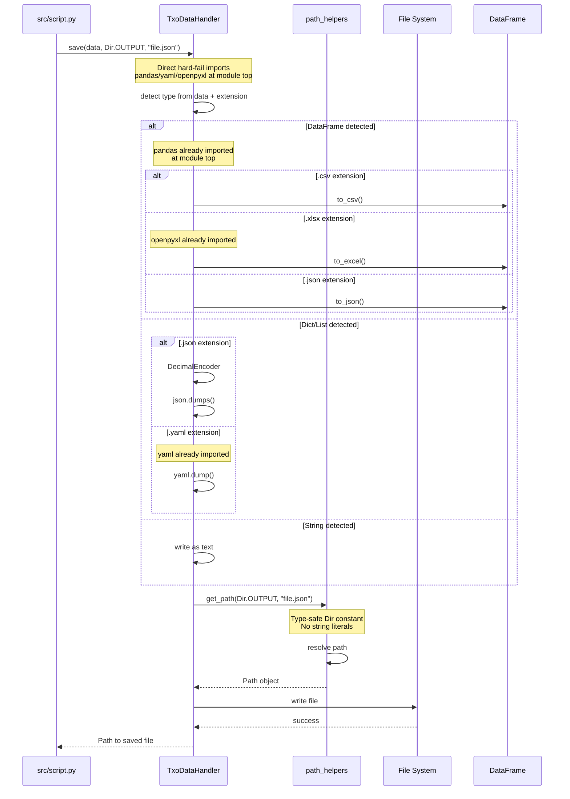

# Module Dependency Diagram v3.1

## Architecture Overview

The TXO Python Template v3.1 follows a layered architecture with clear dependency rules. The v3.1 release adds direct hard-fail imports, UTC timestamp utilities, and complete ADR compliance with enhanced code quality.

## Dependency Layers

### Layer 1: Foundation (No Dependencies)
- `exceptions.py` - Custom exception hierarchy with `ErrorContext`
- `path_helpers.py` - Path management with `Dir` constants

### Layer 2: Core Services
- `logger.py` - Depends on: path_helpers
  - Contains: `TxoLogger`, `TokenRedactionFilter`, `ContextFilter`
- `api_common.py` - Depends on: logger
  - Contains: `RateLimiter`, `CircuitBreaker`, retry utilities

### Layer 3: Data & I/O
- `load_n_save.py` - Depends on: exceptions, logger, path_helpers
  - Direct hard-fail imports (pandas, yaml, openpyxl)
  - Universal save() method with UTC timestamp support

### Layer 4: API Implementation
- `oauth_helpers.py` - Depends on: logger, exceptions
- `rest_api_helpers.py` - Depends on: logger, exceptions, api_common
  - Contains: `MinimalRestAPI`, `SessionManager`, `RestOperationResult`
- `soap_api_helpers.py` - Depends on: logger, exceptions, api_common
- `url_helpers.py` - Depends on: logger

### Layer 5: Orchestration
- `config_loader.py` - Depends on: logger, path_helpers, load_n_save, exceptions
- `api_factory.py` - Depends on: logger, rest_api_helpers, soap_api_helpers, api_common
  - Creates: `RateLimiter`, `CircuitBreaker` instances
- `script_runner.py` - Depends on: config_loader, oauth_helpers, logger, exceptions
  - Token optional by default, hard-fail configuration access

### Layer 6: User Scripts
- `src/*.py` - Depends on: script_runner, api_factory, load_n_save, exceptions, logger, path_helpers

## Visual Dependency Graph

## Key Sequence Flows

### Script Initialization (v3.1)

### API Call with v3.1 Resilience

### Universal Save with Type Detection

---

**For technical refactoring guidance, see:**
- **Framework Development**: `ai/reports/refactoring.md`
- **Function Reference**: `ai/decided/utils-quick-reference_v3.1.md`
- **Architecture Decisions**: `ai/decided/txo-business-adr_v3.1.md`
- **Technical Standards**: `ai/decided/txo-technical-standards_v3.1.md`

---

**Version:** v3.1  
**Last Updated:** 2025-09-28  
**Domain:** Module Dependencies  
**Purpose:** Visual architecture overview and flow understanding  